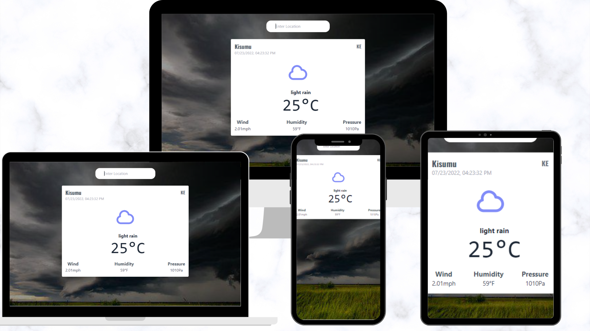

# Weather App

weather app is a web application that shows the temperature, pressure, humidity and cloud of all locations in the world according to are of search. it uses an API to fetch weather data and displays in the UI

## Technology 

- React
- Redux

## Screenshot


## Live Demo


## Run Locally

Clone the project

```bash
  git clone git@github.com:Josphat205/Weather-App-React.git
```

Go to the project directory

```bash
  cd Weather-App-React
```

Install dependencies

```bash
  npm install
```

Start the server

```bash
  npx eslint . --fix
  npm run start
```


## Josphat Kiploman

- [@Github](https://github.com/Josphat205)

- [@Linkedin](https://www.linkedin.com/in/josphat-kiploman-797430236/)


## 🤝 Contributing

Contributions, issues, and feature requests are welcome!

## Show your support

Give a ⭐ if you like this project!

## 📝 License

This project is [MIT](./MIT.md) licensed.


